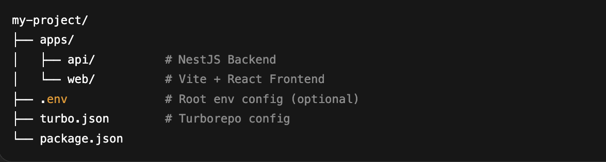
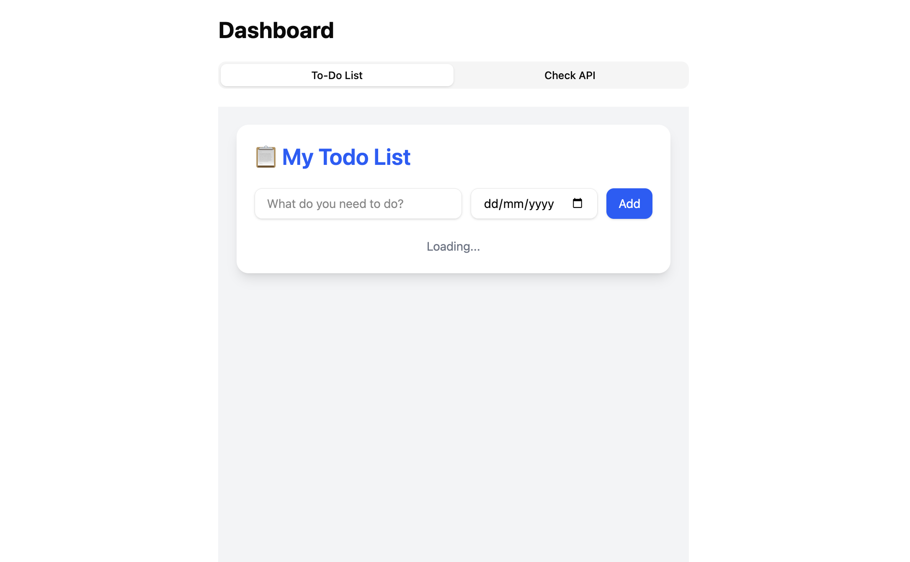
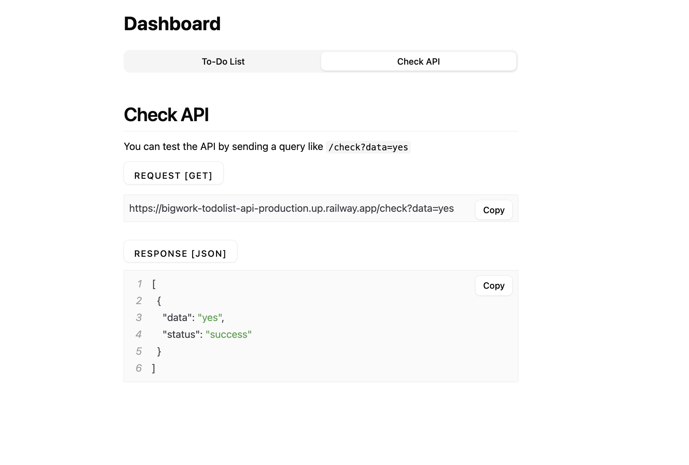
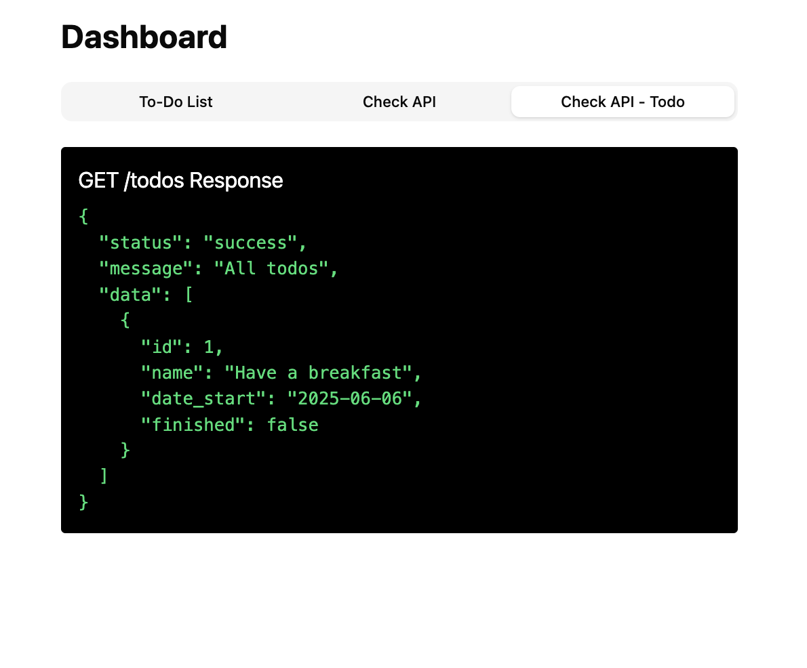
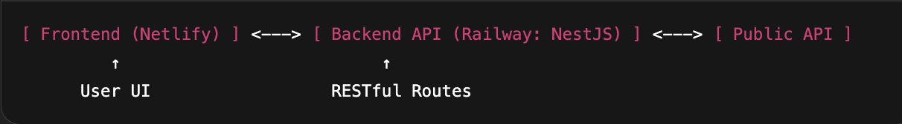

📋 TodoList & API Checker App

A full-stack web application combining a sleek TodoList manager and a public API checker, built with Vite + React (TypeScript) for the frontend and NestJS for the backend.

Frontend deployed on Netlify
Backend deployed on Railway

🔗 DEMO:
Frontend: https://todolist-checkapi.netlify.app
API: https://bigwork-todolist-api-production.up.railway.app

🌟 Features

🔁 Switch between TodoList and API Checker via ShadCN UI Tabs

✅ Add, complete, and remove todos

🌐 Fetch public APIs from https://bigwork-todolist-api-production.up.railway.app/check?data=yes

⚙️ Full-stack setup using Turborepo

🧪 Error handling on both frontend & backend

🔐 Environment-based configuration using .env

✨ Modern, responsive UI using Tailwind CSS & ShadCN UI

🐞 Toast notifications with react-toastify

🚀 Deployed using Netlify (Frontend) + Railway (Backend)

🏛️ Project Structure

🛠️ System Design
Frontend (Vite + React + TS)
Routing: React Router

UI Library: ShadCN UI, Tailwind CSS

State Management: useState, useEffect

Notifications: React Toastify

Tabs UI: Switch between TodoList and CheckAPI

Backend (NodeJS + TypeScript)
Framework: NestJS

Controllers: /api/todos/routes

Validation: DTO + Pipes

CORS Config: For cross-origin support (Netlify ↔ Railway)

Port: Uses process.env.PORT for Railway

📦 Environment Variables
Frontend .env (apps/web/.env)
VITE_API_URL=https://bigwork-todolist-api-production.up.railway.app/todos

Backend .env (apps/api/.env)
PORT=8080

🧩 Installation
1. Clone the Repository
git clone https://github.com/pappa6395/BigWork-TodoList-Api.git
cd bigwork-todo-api

2. Setup Backend
cd apps/api
npm install
cp .env.example .env
# Edit the .env file if needed
npm run start:dev

3. Setup Frontend
cd ../web
npm install
cp .env.example .env
npm run dev

🧪 Sample API Endpoint

GET /api/v1/todos → Fetch todo list
GET https://bigwork-todolist-api-production.up.railway.app/check?data=yes → Fetch APIs from Public API source

🛡️ Error Handling

Backend: Uses NestJS exception filters for clean API responses

Frontend: Toast notifications for failed requests and alerts

Design UI/UX

- Frontend UI for todolists

- Frontend UI for check-api

- Also check-api for todolists

🗺️ Summary Diagram

🚀 Future Improvements

- Add authentication (Login/Signup)

- Connect to a database for persistent todos

- PWA support (offline-friendly)

- Charts for API usage metrics

- Add unit & E2E testing

👨 Developed By
Nontachai Pahsukkul (Pap)
Built with ❤️ using NestJS, Vite, and Turborepo.